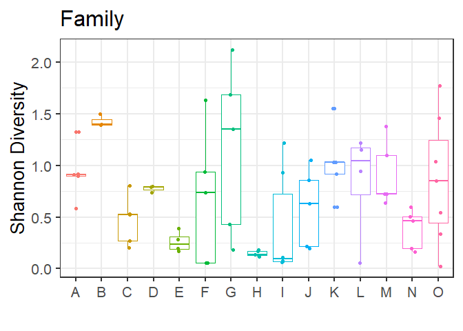
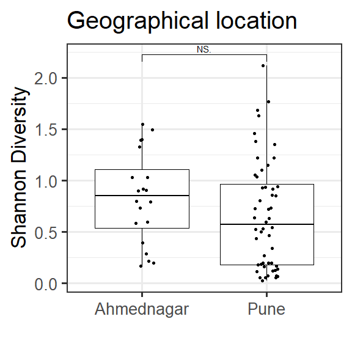

# Alpha diversity analysis

## Estimate alpha diversities

### with respect to Family

    ## 
    ##  Kruskal-Wallis rank sum test
    ## 
    ## data:  index by factor(Family)
    ## Kruskal-Wallis chi-squared = 28.158, df = 14, p-value = 0.01356

### Diet

    ## 
    ##  Wilcoxon rank sum test with continuity correction
    ## 
    ## data:  index by factor(Diet)
    ## W = 363, p-value = 0.0331
    ## alternative hypothesis: true location shift is not equal to 0

    ## 
    ##  Wilcoxon rank sum test with continuity correction
    ## 
    ## data:  index by factor(Diet)
    ## W = 363, p-value = 0.0331
    ## alternative hypothesis: true location shift is not equal to 0

    ## [1] 0.004 0.040 0.200 0.400

### Age

    ## 
    ##  Kruskal-Wallis rank sum test
    ## 
    ## data:  index by factor(Age)
    ## Kruskal-Wallis chi-squared = 0.65216, df = 2, p-value = 0.7217

    ## 
    ##  Wilcoxon rank sum exact test
    ## 
    ## data:  index by factor(Age)
    ## W = 233, p-value = 0.4016
    ## alternative hypothesis: true location shift is not equal to 0

    ## 
    ##  Wilcoxon rank sum exact test
    ## 
    ## data:  index by factor(Age)
    ## W = 239, p-value = 0.6153
    ## alternative hypothesis: true location shift is not equal to 0

    ## 
    ##  Wilcoxon rank sum exact test
    ## 
    ## data:  index by factor(Age)
    ## W = 319, p-value = 0.9182
    ## alternative hypothesis: true location shift is not equal to 0

    ## [1] 0.004 0.040 0.200 0.400

### Gender

    ## 
    ##  Wilcoxon rank sum exact test
    ## 
    ## data:  index by factor(Gender)
    ## W = 674, p-value = 0.7361
    ## alternative hypothesis: true location shift is not equal to 0

### Geographical Location

    ## 
    ##  Wilcoxon rank sum test with continuity correction
    ## 
    ## data:  index by factor(Location)
    ## W = 652, p-value = 0.09828
    ## alternative hypothesis: true location shift is not equal to 0

    ## geom_signif: na.rm = FALSE, extend_line = 0, parse = FALSE, orientation = NA
    ## stat_signif: na.rm = FALSE, comparisons = list(c("Ahmednagar", "Pune")), test = wilcox.test, test.args = NULL, annotations = NULL, map_signif_level = TRUE, y_position = NULL, xmin = NULL, xmax = NULL, margin_top = 0.05, step_increase = 0, tip_length = 0.03, manual = FALSE, orientation = NA
    ## position_identity

    ## 
    ##  Wilcoxon rank sum test with continuity correction
    ## 
    ## data:  index by factor(Location)
    ## W = 652, p-value = 0.09828
    ## alternative hypothesis: true location shift is not equal to 0

    ## [1] 0.004 0.040 0.200 0.400

