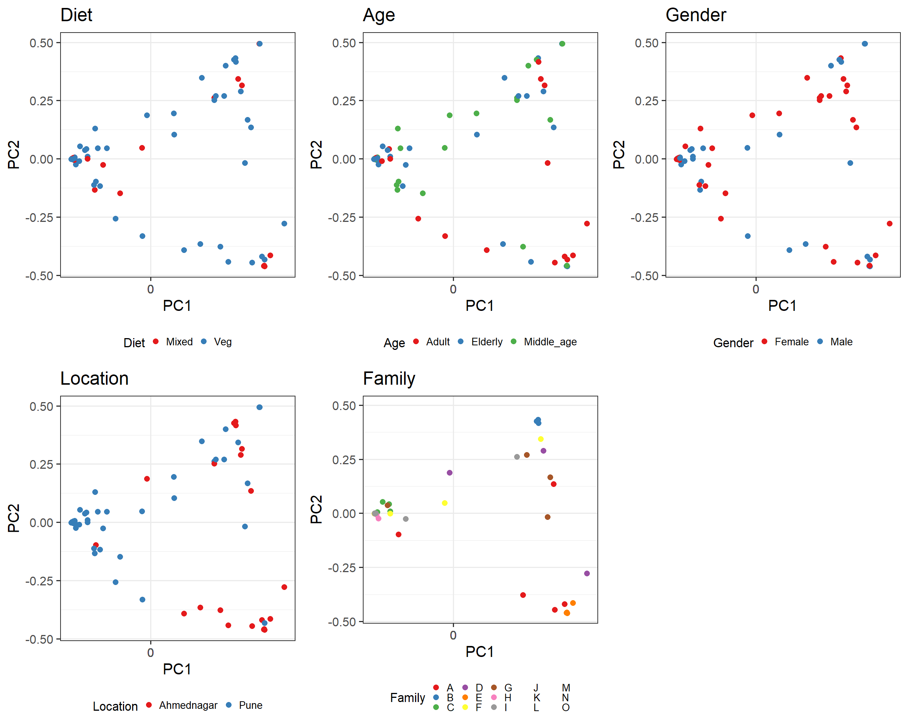

# PCoA analysis

## *Principal Coordinates Analysis (PCoA)*

-   Ordination method: PCoA
-   Dissimilarity measure: bray

# PERMANOVA analysis

    ## Permutation: free
    ## Number of permutations: 199
    ## 
    ## Terms added sequentially (first to last)
    ## 
    ##           Df SumsOfSqs MeanSqs F.Model      R2 Pr(>F)   
    ## Diet       1    0.1249  0.1249  0.6446 0.00616  0.635   
    ## Age        2    0.4843  0.2421  1.2492 0.02388  0.280   
    ## Gender     1    0.1975  0.1975  1.0188 0.00974  0.380   
    ## Location   1    3.4593  3.4593 17.8464 0.17060  0.005 **
    ## Family    14    5.9317  0.4237  2.1858 0.29253  0.005 **
    ## Residuals 52   10.0795  0.1938         0.49708          
    ## Total     71   20.2772                 1.00000          
    ## ---
    ## Signif. codes:  0 '***' 0.001 '**' 0.01 '*' 0.05 '.' 0.1 ' ' 1

# Conclusion-

Here we found that geographical location and families are significantly
associated with bacterial community composition. No significant
difference were observed in Age, Gender and Diet group.
