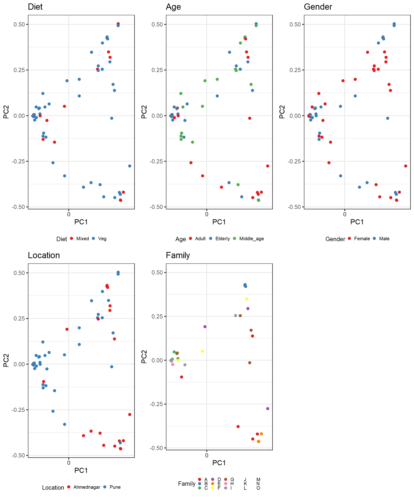
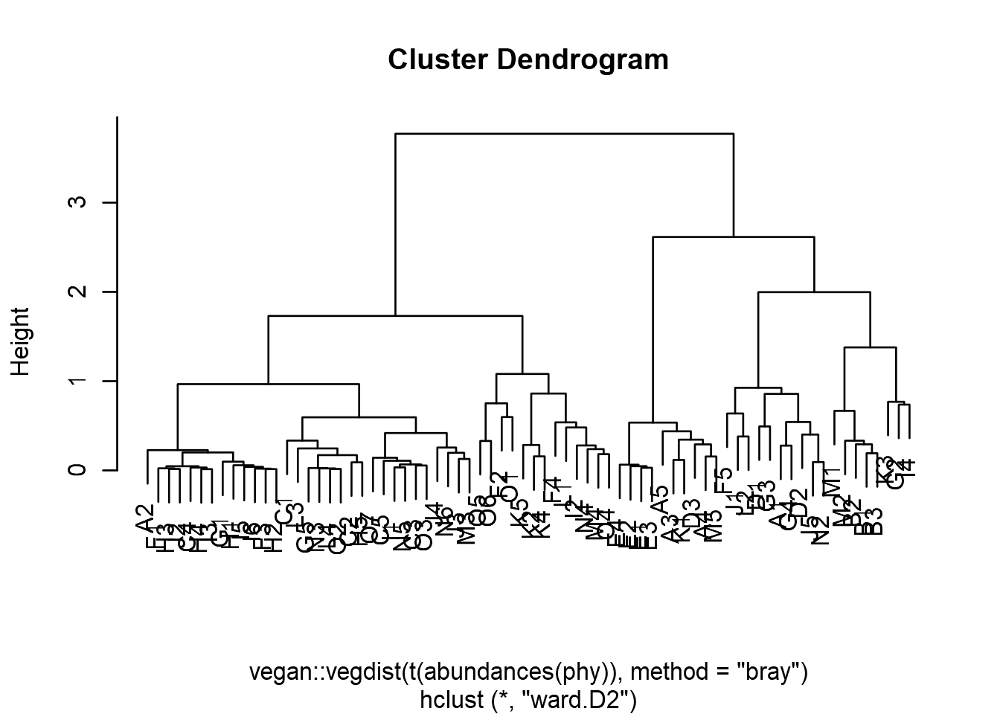

## *Principal Coordinates Analysis (PCoA)*

-   Ordination method: PCoA
-   Dissimilarity measure: bray

# PERMANOVA analysis

    ## 
    ## Call:
    ## adonis(formula = t(otu_table(phy)) ~ Diet, data = meta(phy),      permutations = 99, method = distance) 
    ## 
    ## Permutation: free
    ## Number of permutations: 99
    ## 
    ## Terms added sequentially (first to last)
    ## 
    ##           Df SumsOfSqs MeanSqs F.Model      R2 Pr(>F)
    ## Diet       1    0.1282 0.12825 0.44237 0.00628   0.84
    ## Residuals 70   20.2938 0.28991         0.99372       
    ## Total     71   20.4221                 1.00000

    ## 
    ## Call:
    ## adonis(formula = t(otu_table(phy)) ~ Age, data = meta(phy), permutations = 99,      method = distance) 
    ## 
    ## Permutation: free
    ## Number of permutations: 99
    ## 
    ## Terms added sequentially (first to last)
    ## 
    ##           Df SumsOfSqs MeanSqs F.Model     R2 Pr(>F)
    ## Age        2    0.4943 0.24714 0.85573 0.0242   0.51
    ## Residuals 69   19.9278 0.28881         0.9758       
    ## Total     71   20.4221                 1.0000

    ## 
    ## Call:
    ## adonis(formula = t(otu_table(phy)) ~ Gender, data = meta(phy),      permutations = 99, method = distance) 
    ## 
    ## Permutation: free
    ## Number of permutations: 99
    ## 
    ## Terms added sequentially (first to last)
    ## 
    ##           Df SumsOfSqs MeanSqs F.Model     R2 Pr(>F)
    ## Gender     1     0.196 0.19602 0.67841 0.0096   0.62
    ## Residuals 70    20.226 0.28894         0.9904       
    ## Total     71    20.422                 1.0000

    ## 
    ## Call:
    ## adonis(formula = t(otu_table(phy)) ~ Location, data = meta(phy),      permutations = 99, method = distance) 
    ## 
    ## Permutation: free
    ## Number of permutations: 99
    ## 
    ## Terms added sequentially (first to last)
    ## 
    ##           Df SumsOfSqs MeanSqs F.Model      R2 Pr(>F)   
    ## Location   1    3.6538  3.6538  15.253 0.17891   0.01 **
    ## Residuals 70   16.7683  0.2395         0.82109          
    ## Total     71   20.4221                 1.00000          
    ## ---
    ## Signif. codes:  0 '***' 0.001 '**' 0.01 '*' 0.05 '.' 0.1 ' ' 1

    ## 
    ## Call:
    ## adonis(formula = t(otu_table(phy)) ~ Family, data = meta(phy),      permutations = 99, method = distance) 
    ## 
    ## Permutation: free
    ## Number of permutations: 99
    ## 
    ## Terms added sequentially (first to last)
    ## 
    ##           Df SumsOfSqs MeanSqs F.Model      R2 Pr(>F)   
    ## Family    14    9.3311 0.66651  3.4254 0.45691   0.01 **
    ## Residuals 57   11.0910 0.19458         0.54309          
    ## Total     71   20.4221                 1.00000          
    ## ---
    ## Signif. codes:  0 '***' 0.001 '**' 0.01 '*' 0.05 '.' 0.1 ' ' 1

# Conclusion-

Here we found that geographical location is significantly accosiated
with bacterial community composition. No significant difference were
obseved in Age, Gender and Diet group.

## Hierarchical clustering using Ward2 method

