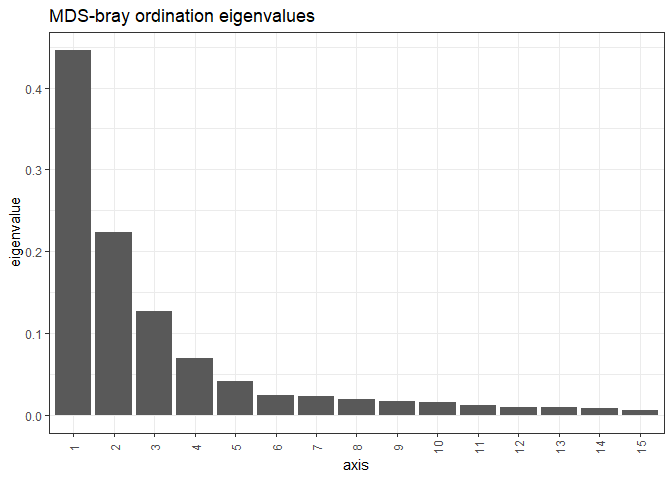
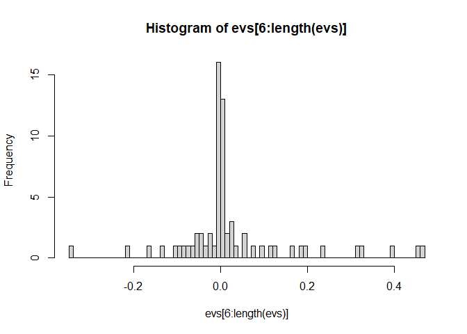
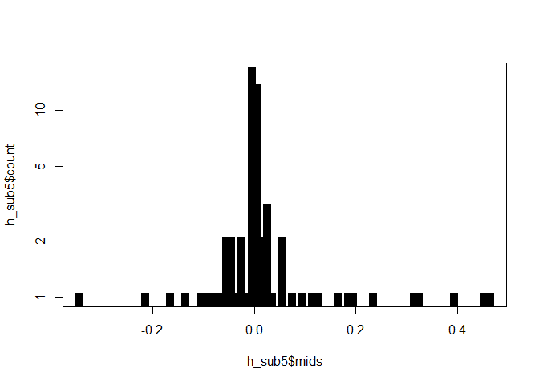
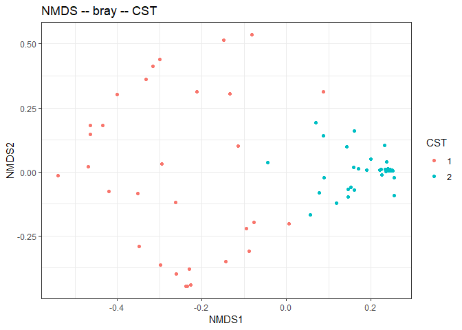
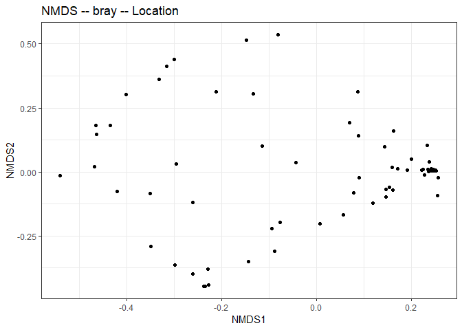
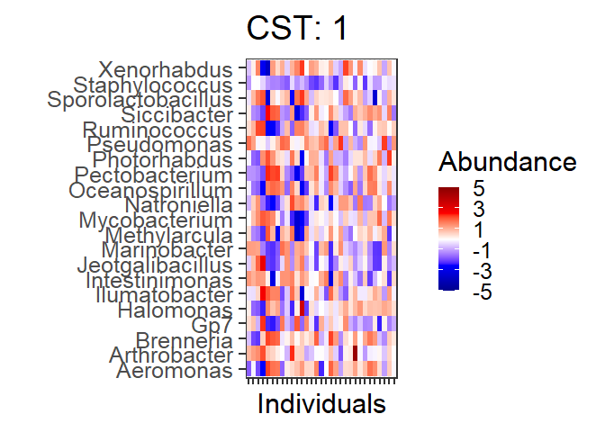
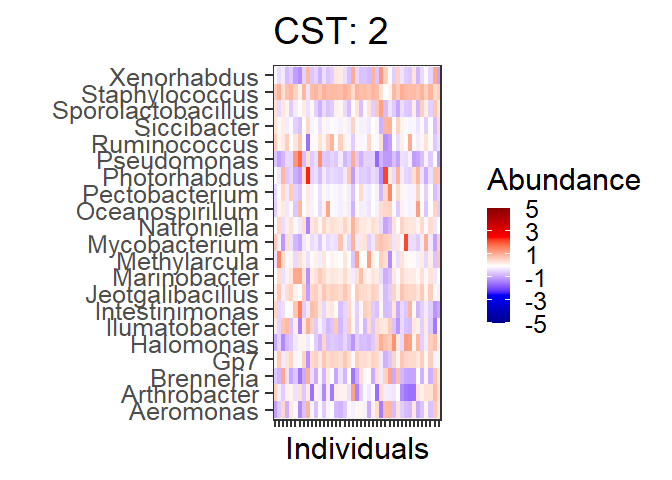

# Cluster into CSTs

    ##  [1] 8.75775097 4.40156055 2.50599296 1.36019435 0.80829686 0.46784380 0.45627973 0.39441635 0.32384620 0.31709805 0.23450905 0.19991049 0.18240514
    ## [14] 0.16764170 0.12903379 0.11120385 0.09299761 0.07605357 0.05464217 0.05146103

    ## [1] -0.09125909 -0.10843468 -0.13350852 -0.16676322 -0.21296905 -0.34684814

## Denoise distance matrix

## Determine number of clusters

We will use the gap statistic to indicate the number of clusters in this
data:

## Cluster into CSTs

Perform PAM K-fold clusters and assess significance of CST vs. location
(p-value)

    ## 
    ##  Fisher's Exact Test for Count Data
    ## 
    ## data:  table(sample_data(ps)[, c("CST", "Location")])
    ## p-value = 5.608e-07
    ## alternative hypothesis: true odds ratio is not equal to 1
    ## 95 percent confidence interval:
    ##    5.089499 255.067102
    ## sample estimates:
    ## odds ratio 
    ##   25.53808

## Evaluate clustering

# Principal Coordinates Analysis (PCoA)

Coloured by CST community type

### Heatmap

Heatmaps for the community state types. The most different OTUs are
shown.

