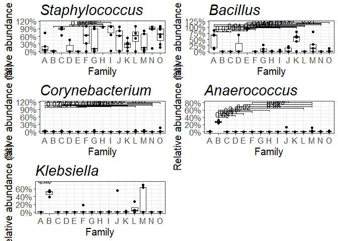

## DAA for family using ANCOM-BC2, prevl cut off 1/100

    ##          taxon lfc_FamilyB    q_FamilyB
    ## 1     Bacillus   -5.570335 3.606502e-06
    ## 2 Anaerococcus    4.526208 4.421671e-02
    ## 3   Klebsiella    9.087959 4.421671e-02

