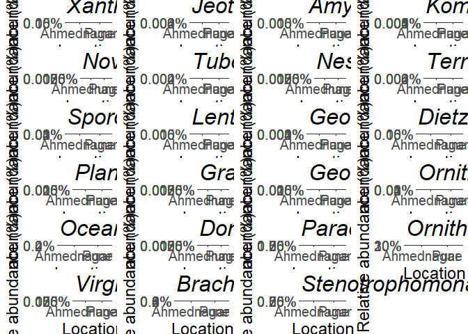
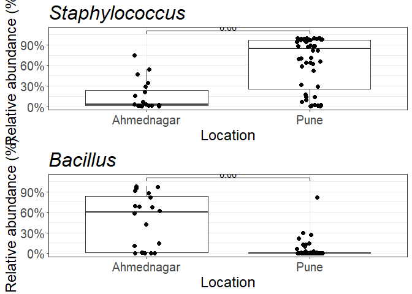

## DAA for location using ANCOM-BC2

    ##              taxon lfc_LocationPune q_LocationPune
    ## 1          Dickeya        1.3838856   1.027707e-06
    ## 2     Domibacillus       -0.9094751   2.262506e-04
    ## 3         Gordonia        0.8443071   2.262506e-04
    ## 4      Xanthomonas        0.9350148   2.438166e-04
    ## 5         Bacillus       -3.2599783   6.960251e-04
    ## 6 Jeotgalibacillus       -0.7341306   6.960251e-04

