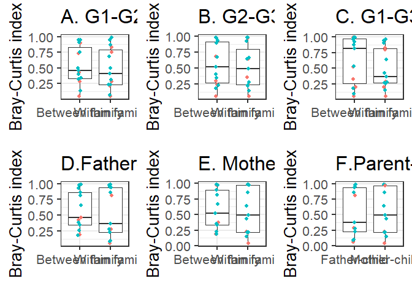

# G1-G2 (location, gender matched)

# G2-G3 (location, gender matched)

# G1-G3 (location, gender matched)

# Father-child location-wise

# Mother-child (genetic relatedness) with location

# Mother-child and father-child comparisons within family

    ##       grp      grp1      grp2      grp3      grp4      grp5 
    ## 0.9795437 0.9795437 0.9795437 0.9795437 0.9795437 0.9795437

