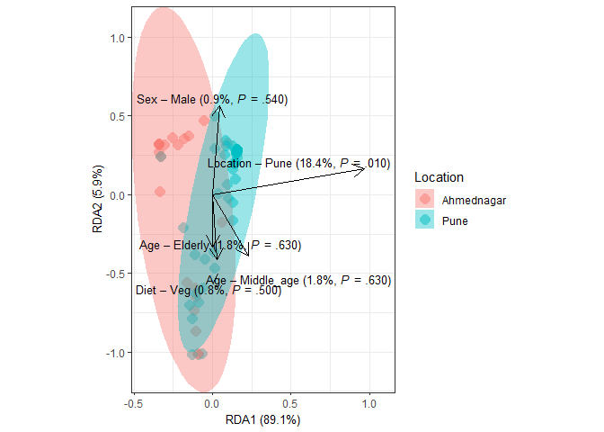

<table>
<colgroup>
<col style="width: 5%" />
<col style="width: 1%" />
<col style="width: 7%" />
<col style="width: 7%" />
<col style="width: 4%" />
<col style="width: 9%" />
<col style="width: 12%" />
<col style="width: 50%" />
</colgroup>
<thead>
<tr class="header">
<th style="text-align: left;"></th>
<th style="text-align: right;">Df</th>
<th style="text-align: right;">SumOfSqs</th>
<th style="text-align: right;">F</th>
<th style="text-align: right;">Pr(&gt;F)</th>
<th style="text-align: right;">Total variance</th>
<th style="text-align: right;">Explained variance</th>
<th style="text-align: left;">Homogeneity p-value (NULL hyp:
distinct/homogeneous –&gt; permanova suitable)</th>
</tr>
</thead>
<tbody>
<tr class="odd">
<td style="text-align: left;">Model</td>
<td style="text-align: right;">5</td>
<td style="text-align: right;">4.3486095</td>
<td style="text-align: right;">3.7916841</td>
<td style="text-align: right;">0.01</td>
<td style="text-align: right;">19.48744</td>
<td style="text-align: right;">0.2231494</td>
<td style="text-align: left;">NA</td>
</tr>
<tr class="even">
<td style="text-align: left;">Location</td>
<td style="text-align: right;">1</td>
<td style="text-align: right;">3.5764757</td>
<td style="text-align: right;">15.5921868</td>
<td style="text-align: right;">0.01</td>
<td style="text-align: right;">19.48744</td>
<td style="text-align: right;">0.1835273</td>
<td style="text-align: left;">0.215394….</td>
</tr>
<tr class="odd">
<td style="text-align: left;">Diet</td>
<td style="text-align: right;">1</td>
<td style="text-align: right;">0.1500872</td>
<td style="text-align: right;">0.6543277</td>
<td style="text-align: right;">0.50</td>
<td style="text-align: right;">19.48744</td>
<td style="text-align: right;">0.0077017</td>
<td style="text-align: left;">0.997865….</td>
</tr>
<tr class="even">
<td style="text-align: left;">Sex</td>
<td style="text-align: right;">1</td>
<td style="text-align: right;">0.1754532</td>
<td style="text-align: right;">0.7649150</td>
<td style="text-align: right;">0.54</td>
<td style="text-align: right;">19.48744</td>
<td style="text-align: right;">0.0090034</td>
<td style="text-align: left;">0.536036….</td>
</tr>
<tr class="odd">
<td style="text-align: left;">Age</td>
<td style="text-align: right;">2</td>
<td style="text-align: right;">0.3421103</td>
<td style="text-align: right;">0.7457408</td>
<td style="text-align: right;">0.63</td>
<td style="text-align: right;">19.48744</td>
<td style="text-align: right;">0.0175554</td>
<td style="text-align: left;">0.717219….</td>
</tr>
<tr class="even">
<td style="text-align: left;">Residual</td>
<td style="text-align: right;">66</td>
<td style="text-align: right;">15.1388257</td>
<td style="text-align: right;">NA</td>
<td style="text-align: right;">NA</td>
<td style="text-align: right;">19.48744</td>
<td style="text-align: right;">0.7768506</td>
<td style="text-align: left;">NA</td>
</tr>
</tbody>
</table>

