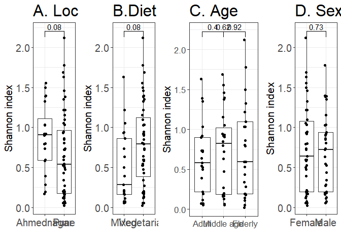
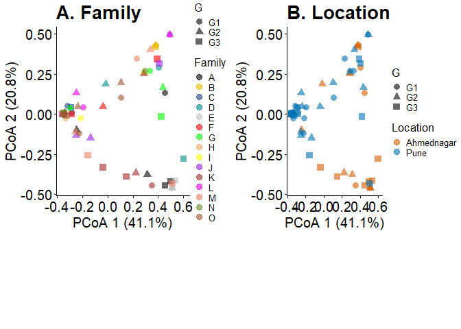
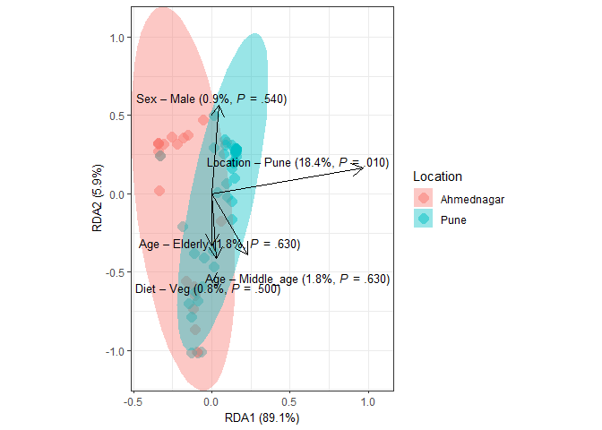

## Alpha diversity analysis for confounding factors

    ##       Diet   Location        Sex        Age 
    ## 0.08853315 0.08853315 0.73032083 0.73032083

## Beta diversity analysis for confounding factors

    ## Permutation test for adonis under reduced model
    ## Marginal effects of terms
    ## Permutation: free
    ## Number of permutations: 999
    ## 
    ## adonis2(formula = t(assay(tse, "relabundance")) ~ Diet + Age + Family + Sex + Location, data = colData(tse), permutations = 999, method = "bray", by = "margin")
    ##          Df SumOfSqs      R2      F Pr(>F)    
    ## Diet      1   0.0407 0.00209 0.2216  0.933    
    ## Age       2   0.4043 0.02075 1.1014  0.364    
    ## Family   13   5.4117 0.27770 2.2682  0.001 ***
    ## Sex       1   0.1596 0.00819 0.8698  0.480    
    ## Location  0   0.0000 0.00000   -Inf           
    ## Residual 53   9.7271 0.49915                  
    ## ---
    ## Signif. codes:  0 '***' 0.001 '**' 0.01 '*' 0.05 '.' 0.1 ' ' 1

## dbRDA flr confounding factors

