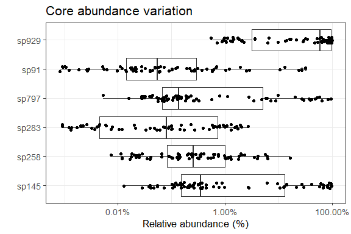

# Core microbiota.

Core microbiota is here defined based on the following parameters:

-   Detection threshold (relative abundance): 0.1%
-   Prevalence threshold (above threshold in the population) 20%.

The following taxonomic groups are in the core genera. Mean relative
abundance and population prevalence (above detection threshold) are
shown.

Phylum abundance table (relative abundance % and prevalance):

<table>
<colgroup>
<col style="width: 19%" />
<col style="width: 36%" />
<col style="width: 19%" />
<col style="width: 24%" />
</colgroup>
<thead>
<tr class="header">
<th style="text-align: left;">Taxon</th>
<th style="text-align: right;">Mean Relative abundance (%)</th>
<th style="text-align: right;">Prevalence (%)</th>
<th style="text-align: right;">Standard deviation</th>
</tr>
</thead>
<tbody>
<tr class="odd">
<td style="text-align: left;">Firmicutes</td>
<td style="text-align: right;">73.0</td>
<td style="text-align: right;">100.0</td>
<td style="text-align: right;">0.34</td>
</tr>
<tr class="even">
<td style="text-align: left;">Proteobacteria</td>
<td style="text-align: right;">23.8</td>
<td style="text-align: right;">97.2</td>
<td style="text-align: right;">0.32</td>
</tr>
<tr class="odd">
<td style="text-align: left;">Actinobacteria</td>
<td style="text-align: right;">3.2</td>
<td style="text-align: right;">90.3</td>
<td style="text-align: right;">0.07</td>
</tr>
</tbody>
</table>

# Genus abundance table (relative abundance % and prevalance):

## Abundance variation across samples for each core taxa.

\## Phyla level individual relative abundance bar graph

    ## NULL

