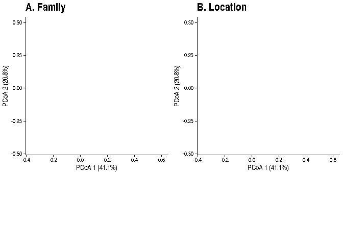

    ## Permutation test for adonis under reduced model
    ## Marginal effects of terms
    ## Permutation: free
    ## Number of permutations: 999
    ## 
    ## adonis2(formula = t(assay(tse, "relabundance")) ~ Location + Diet + Age + Family + Gender, data = colData(tse), permutations = 999, method = "bray", by = "margin")
    ##          Df SumOfSqs      R2      F Pr(>F)    
    ## Location  1   0.3750 0.01924 2.0849  0.080 .  
    ## Diet      1   0.0417 0.00214 0.2318  0.929    
    ## Age       2   0.4007 0.02056 1.1140  0.355    
    ## Family   14   5.6838 0.29167 2.2574  0.001 ***
    ## Gender    1   0.1205 0.00618 0.6701  0.639    
    ## Residual 52   9.3522 0.47991                  
    ## ---
    ## Signif. codes:  0 '***' 0.001 '**' 0.01 '*' 0.05 '.' 0.1 ' ' 1
