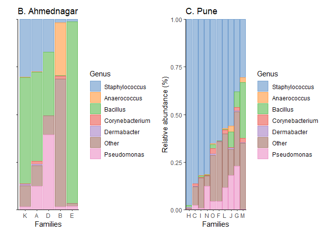
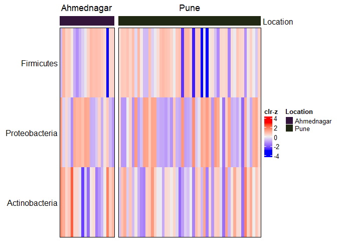

## phylum

## Most prevelent genera

    ## Warning: '.local' is deprecated.
    ## Use 'transformAssay' instead.
    ## See help("Deprecated")

    ## DataFrame with 6 rows and 8 columns
    ##                     Kingdom         Phylum               Class
    ##                 <character>    <character>         <character>
    ## Staphylococcus     Bacteria     Firmicutes             Bacilli
    ## Bacillus           Bacteria     Firmicutes             Bacilli
    ## Corynebacterium    Bacteria Actinobacteria      Actinobacteria
    ## Pseudomonas        Bacteria Proteobacteria Gammaproteobacteria
    ## Anaerococcus       Bacteria     Firmicutes        Tissierellia
    ## Dermabacter        Bacteria Actinobacteria      Actinobacteria
    ##                             Order             Family           Genus      mean
    ##                       <character>        <character>     <character> <numeric>
    ## Staphylococcus         Bacillales  Staphylococcaceae  Staphylococcus 0.5085410
    ## Bacillus               Bacillales        Bacillaceae        Bacillus 0.1632725
    ## Corynebacterium Corynebacteriales Corynebacteriaceae Corynebacterium 0.0104524
    ## Pseudomonas       Pseudomonadales   Pseudomonadaceae     Pseudomonas 0.0917532
    ## Anaerococcus       Tissierellales   Peptoniphilaceae    Anaerococcus 0.0171431
    ## Dermabacter         Micrococcales   Dermabacteraceae     Dermabacter 0.0037439
    ##                      median
    ##                   <numeric>
    ## Staphylococcus  0.602542782
    ## Bacillus        0.003518043
    ## Corynebacterium 0.002534649
    ## Pseudomonas     0.001357755
    ## Anaerococcus    0.000518174
    ## Dermabacter     0.000501896

    ##  Staphylococcus        Bacillus Corynebacterium     Pseudomonas     Dermabacter 
    ##       1.0000000       0.8750000       0.7361111       0.6111111       0.4027778 
    ##    Anaerococcus 
    ##       0.3888889

## Most prevelent phyla

    ## Warning: '.local' is deprecated.
    ## Use 'transformAssay' instead.
    ## See help("Deprecated")

    ## DataFrame with 3 rows and 8 columns
    ##                    Kingdom         Phylum       Class       Order      Family
    ##                <character>    <character> <character> <character> <character>
    ## Firmicutes        Bacteria     Firmicutes          NA          NA          NA
    ## Proteobacteria    Bacteria Proteobacteria          NA          NA          NA
    ## Actinobacteria    Bacteria Actinobacteria          NA          NA          NA
    ##                      Genus      mean    median
    ##                <character> <numeric> <numeric>
    ## Firmicutes              NA 0.7302366 0.9352055
    ## Proteobacteria          NA 0.2380125 0.0262340
    ## Actinobacteria          NA 0.0315763 0.0124432

    ##                 Firmicutes             Proteobacteria 
    ##                  1.0000000                  0.9722222 
    ##             Actinobacteria Candidatus_Melainabacteria 
    ##                  0.9027778                  0.0000000 
    ##             Planctomycetes        Alphaproteobacteria 
    ##                  0.0000000                  0.0000000
