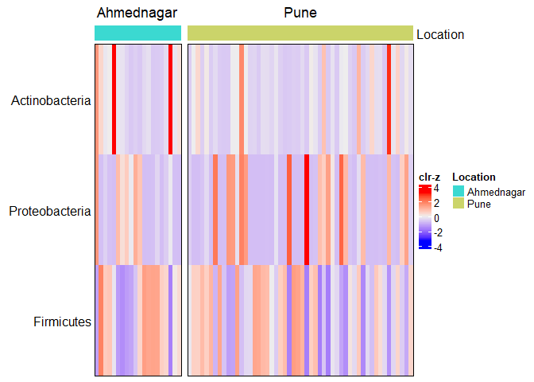

## phylum

## Most prevelent genera

    ## Warning in .local(x, assay.type, assay_name, method, name, ...): '.local' is deprecated.
    ## Use 'transformAssay' instead.
    ## See help("Deprecated")

    ## DataFrame with 6 rows and 10 columns
    ##                     Kingdom         Phylum               Class             Order             Family
    ##                 <character>    <character>         <character>       <character>        <character>
    ## Staphylococcus     Bacteria     Firmicutes             Bacilli        Bacillales  Staphylococcaceae
    ## Bacillus           Bacteria     Firmicutes             Bacilli        Bacillales        Bacillaceae
    ## Corynebacterium    Bacteria Actinobacteria      Actinobacteria Corynebacteriales Corynebacteriaceae
    ## Pseudomonas        Bacteria Proteobacteria Gammaproteobacteria   Pseudomonadales   Pseudomonadaceae
    ## Anaerococcus       Bacteria     Firmicutes        Tissierellia    Tissierellales   Peptoniphilaceae
    ## Dermabacter        Bacteria Actinobacteria      Actinobacteria     Micrococcales   Dermabacteraceae
    ##                           Genus      mean      median         sd        IQR
    ##                     <character> <numeric>   <numeric>  <numeric>  <numeric>
    ## Staphylococcus   Staphylococcus 0.5085410 0.602542782 0.40906985 0.91811542
    ## Bacillus               Bacillus 0.1632725 0.003518043 0.30126772 0.12907531
    ## Corynebacterium Corynebacterium 0.0104524 0.002534649 0.02309582 0.00907590
    ## Pseudomonas         Pseudomonas 0.0917532 0.001357755 0.20525062 0.04975285
    ## Anaerococcus       Anaerococcus 0.0171431 0.000518174 0.05843024 0.00267373
    ## Dermabacter         Dermabacter 0.0037439 0.000501896 0.00602579 0.00607077

    ##  Staphylococcus        Bacillus Corynebacterium     Pseudomonas     Dermabacter    Anaerococcus 
    ##       1.0000000       0.8750000       0.7361111       0.6111111       0.4027778       0.3888889

## Most prevelent phyla

    ## Warning in .local(x, assay.type, assay_name, method, name, ...): '.local' is deprecated.
    ## Use 'transformAssay' instead.
    ## See help("Deprecated")

    ## DataFrame with 3 rows and 10 columns
    ##                    Kingdom         Phylum       Class       Order      Family       Genus      mean
    ##                <character>    <character> <character> <character> <character> <character> <numeric>
    ## Firmicutes        Bacteria     Firmicutes          NA          NA          NA          NA 0.7302366
    ## Proteobacteria    Bacteria Proteobacteria          NA          NA          NA          NA 0.2380125
    ## Actinobacteria    Bacteria Actinobacteria          NA          NA          NA          NA 0.0315763
    ##                   median        sd       IQR
    ##                <numeric> <numeric> <numeric>
    ## Firmicutes     0.9352055 0.3359620 0.5391473
    ## Proteobacteria 0.0262340 0.3214081 0.4938584
    ## Actinobacteria 0.0124432 0.0695169 0.0242467

    ##                 Firmicutes             Proteobacteria             Actinobacteria Candidatus_Melainabacteria 
    ##                  1.0000000                  0.9722222                  0.9027778                  0.0000000 
    ##             Planctomycetes        Alphaproteobacteria 
    ##                  0.0000000                  0.0000000

## Individual wise relative abundances of most prevelent genera in the families across locations: Supplementary figure 2

